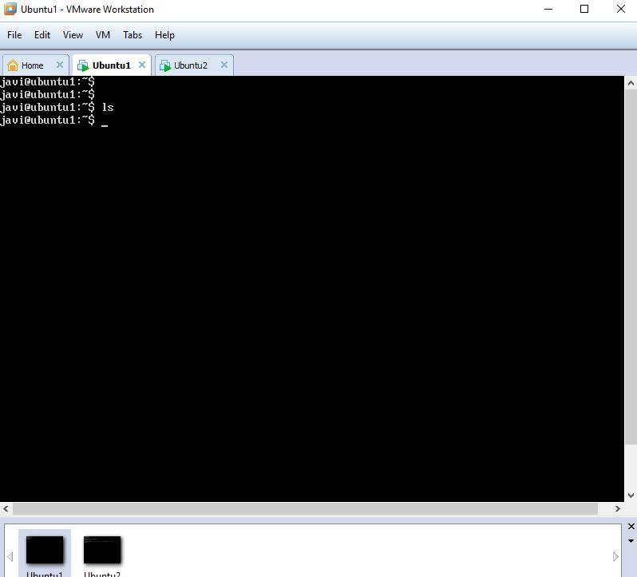
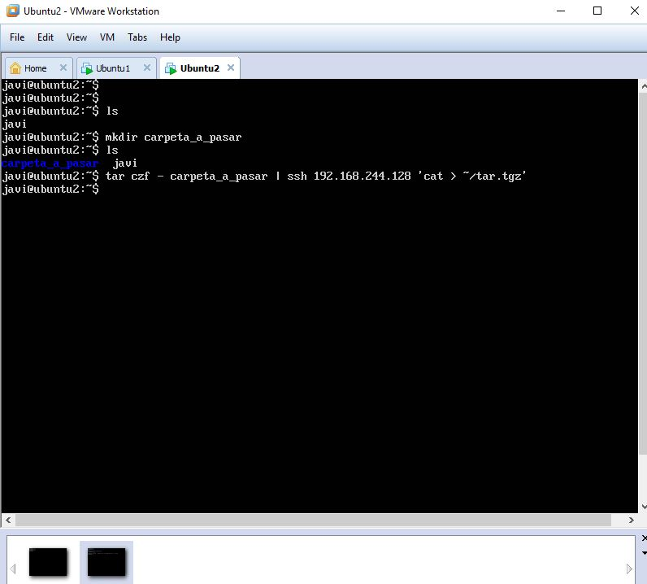
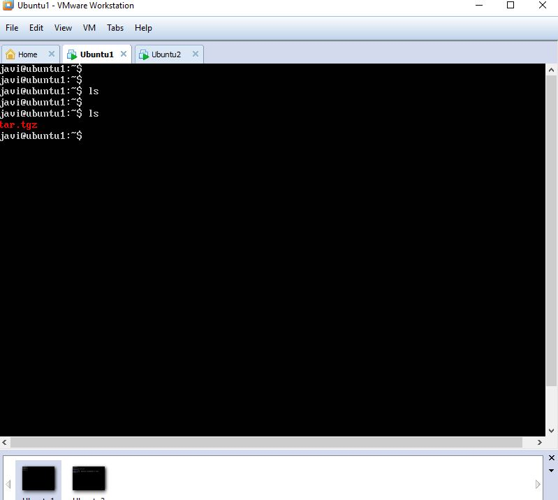
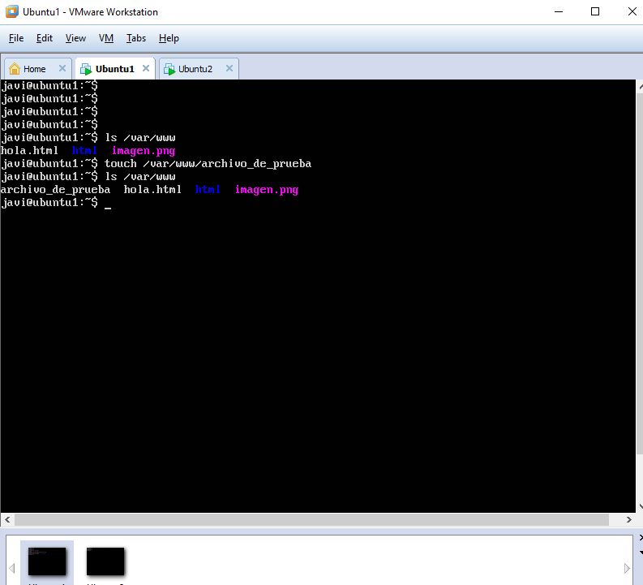
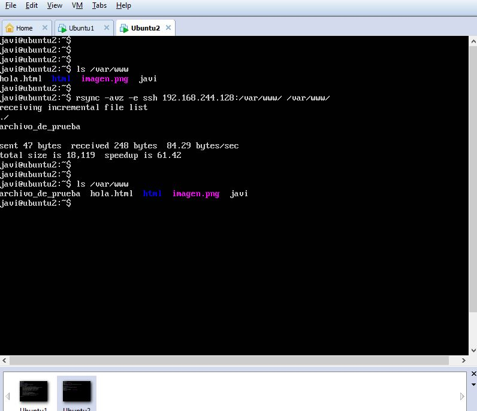
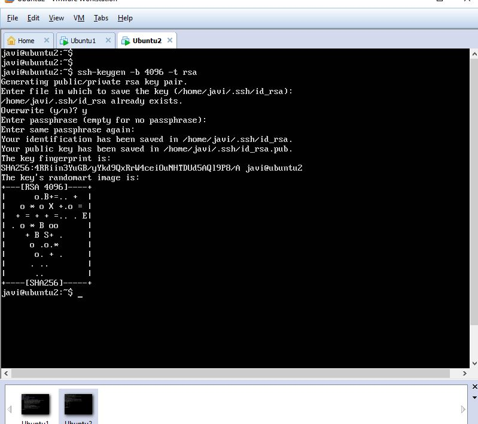
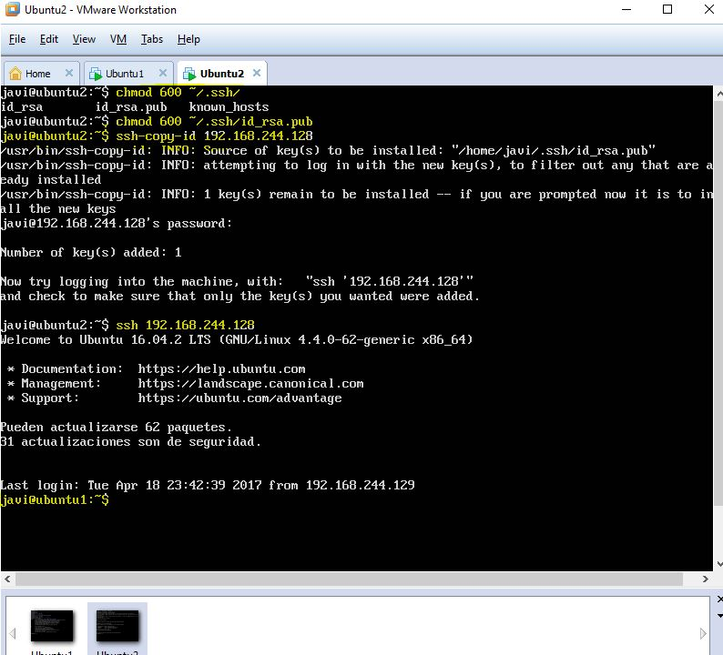
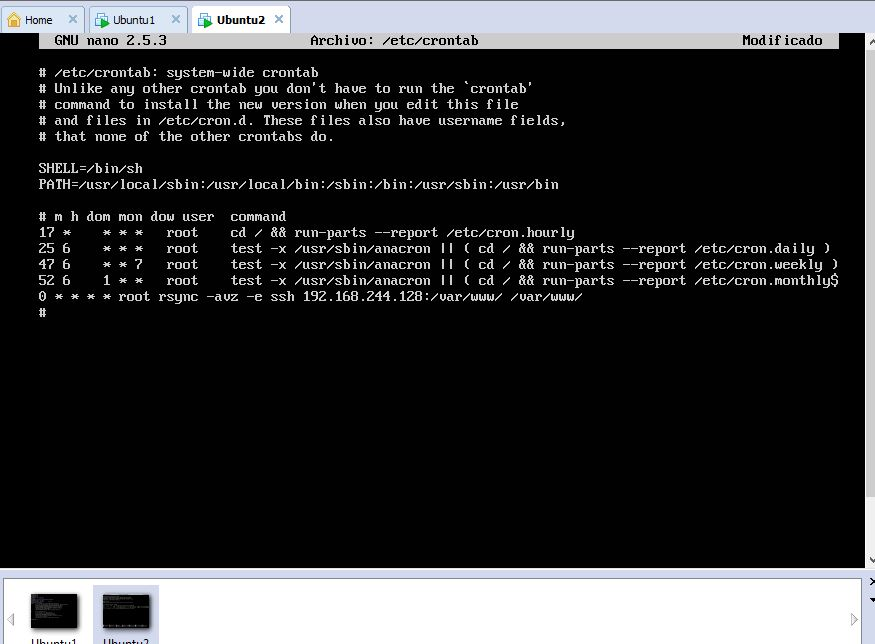

# Práctica 2

### 1. Probar el funcionamiento de la copia de archivos por ssh

Vemos la primera máquina 1 no tiene ningún archivo en el directorio principal.

Creamos un directorio en la máquina 2 y la pasamos a la primera máquina

Volvemos a la máquina 1 y vemos que se ha pasado el directorio por ssh.

### 2. Clonado de una carpeta entre las dos máquinas

Vemos la primera máquina 1 con sus archivos y directorios y creo un fichero de prueba para clonar.

En la máquina 2 vemos los archivos y directorios que hay disponibles y sincronizamos las dos máquinas con sync y vemos el resultado
hemos traído el fichero creado en la máquina 1.

### 3. Configuración de ssh para acceder sin que solicite contraseña

En la máquina 2 creamos una clave ssh con privada y pública

Damos permisos a la clave pública y la compartimos a la máquina 1, ya podemos conectarnos sin contraseña.

### 4. Establecer una tarea en cron que se ejecute cada hora para mantener actualizado el contenido del directorio /var/www entre las dos máquinas

En la última línea del fichero crontab creamos el ejercicio, en el minuto 0 de cada hora sincronizamos una máquina con la otra, 
existen parámetros para hacer una clonación espejo para borrar ficheros que se borren en la otra pero en este caso 
no he utilizado esa posibilidad.

