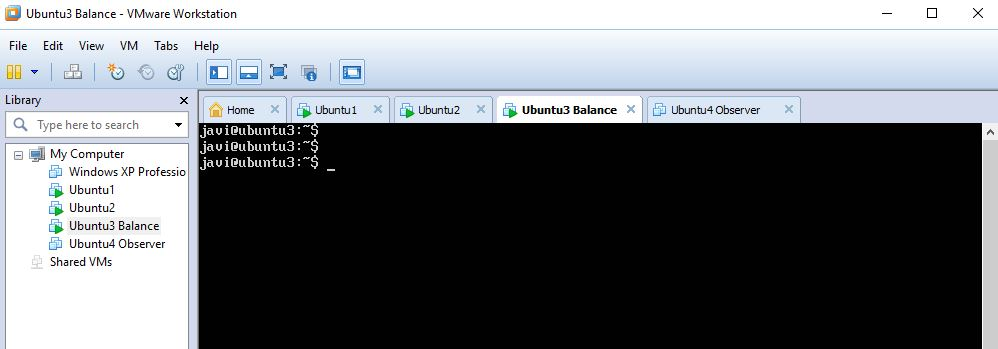
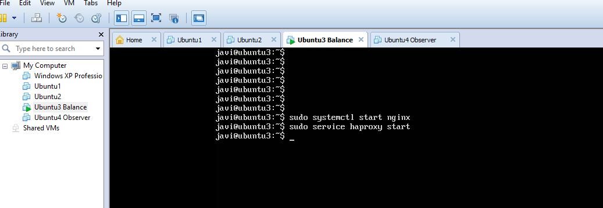
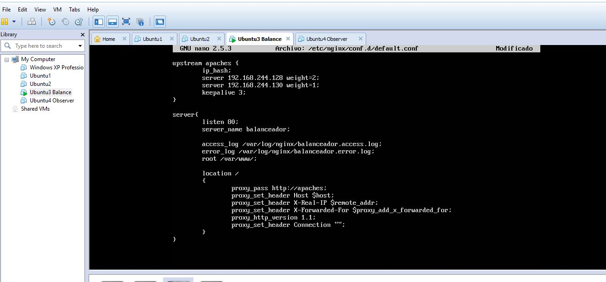
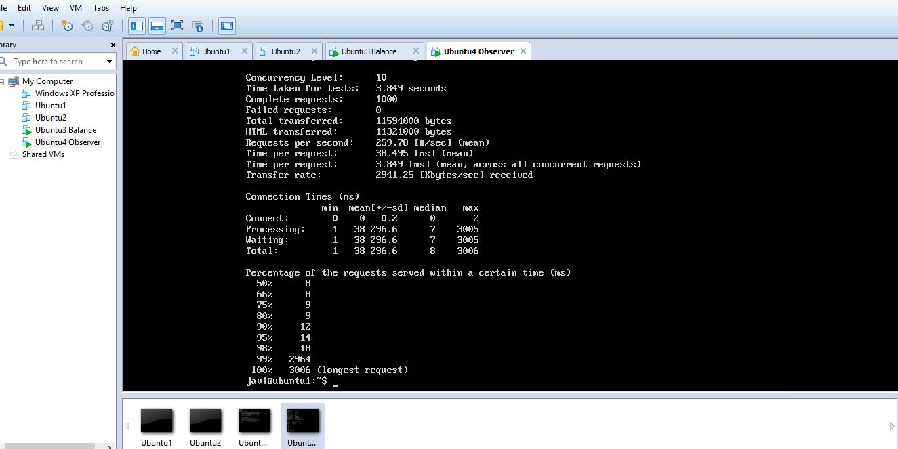
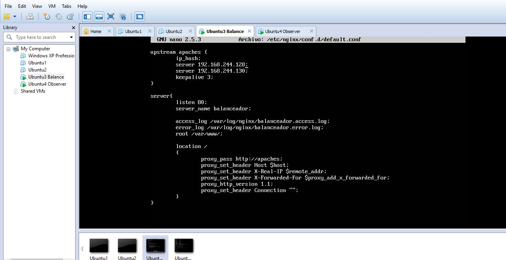
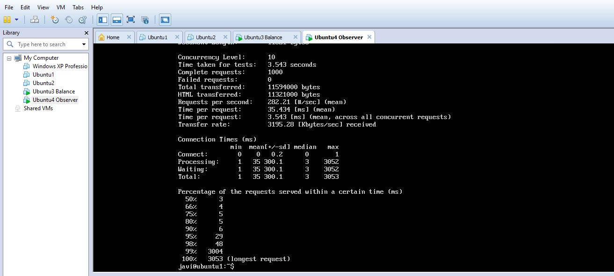
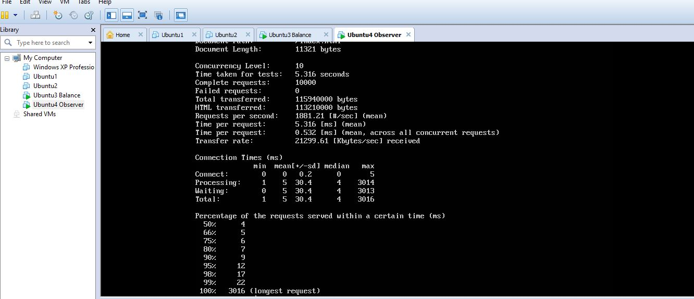
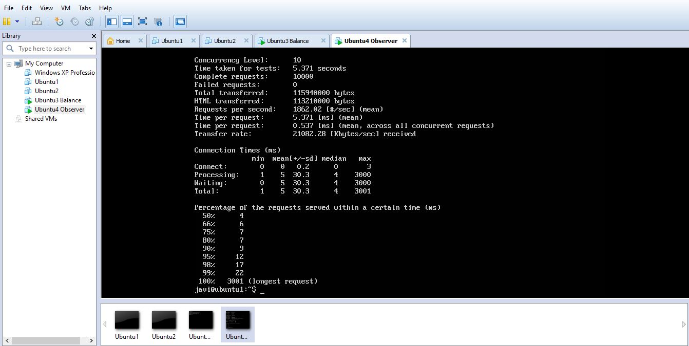

# Práctica 3

Primero sigo los pasos de la práctica para poder aprender a configurar las máquinas, en este momento tengo todo configurado y ahora
repito el proceso para hacer capturas de pantalla y resolver los ejercicios.

## 1 y 2. Configurar máquina:
### 1. Configurar una máquina e instalarle el nginx como balanceador de carga
### 2. Configurar una máquina e instalarle el haproxy como balanceador de carga

He tenido un problema con el puerto 80 ya que no me dejaba usarlo porque ya estaba en uso por haproxy, la solución
ha sido apagar haproxy e iniciarlo después de nginx

Realizo la configuración para el caso de carga con ponderación:

Ejecuto ab para realizar peticiones ( como en el ejercicio 3 ) y así ver como resuelve las peticiones
concretamente he ejecutado ab -n 1000 -c 10 http://192.168.244.129/index.html

Realizo la configuración ahora para el caso de carga Round Robin:

Ejecuto ab para realizar peticiones y así ver como resuelve las peticiones
igualmente he ejecutado ab -n 1000 -c 10 http://192.168.244.129/index.html

### 3. Someter a la granja web a una alta carga, teniendo primero nginx y después haproxy.

He ejecutado en la 4a máquina ab -n 10000 -c 10 http://192.168.244.129/index.html en el primer caso ( nginx )
vemos este resultado

Para el segundo caso ( con haproxy ) vemos el siguiente resultado

