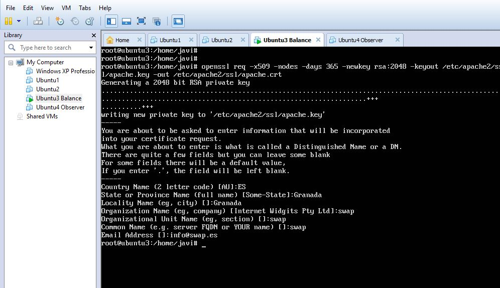

# Práctica 4

### 1. Instalar un certificado SSL autofirmado para configurar el acceso HTTPS a los servidores.

Configuramos el acceso https

Editamos el archivo default-ssl

Y por último reiniciamos el servicio para actualizar la configuración:

### 2. Configurar las reglas del cortafuegos con IPTABLES para asegurar el acceso a
los servidores web, permitiendo el acceso por los puertos de HTTP y HTTPS.
Esta configuración se puede hacer en la misma máquina balanceadora. En
cualquier caso se debe poner en un script que se ejecute en el arranque del
sistema.

Compruebo el estado del cortafuegos

Creo el script que servirá para aceptar tráfico por HTTP y HTTPS

Y por último ejecuto el script

