# Práctica 5

### 1. Crear una BD con al menos una tabla y algunos datos.

Vemos la secuencia de creación:

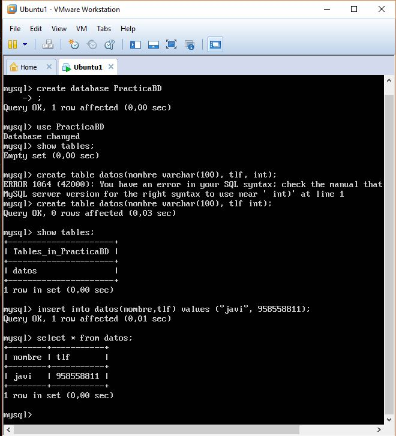

### 2. Realizar la copia de seguridad de la BD completa usando mysqldump.

Realizamos la copia de seguridad siguiendo los pasos del manual de prácticas:

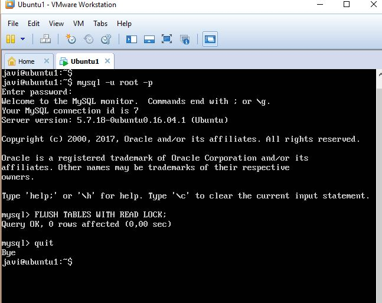

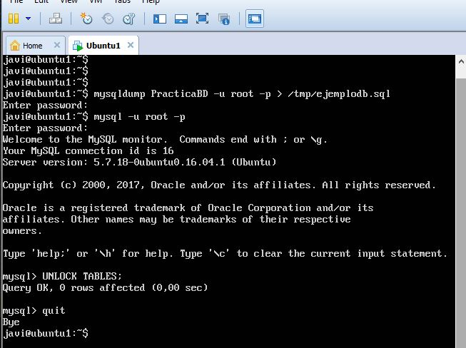

### 3. Restaurar dicha copia en la segunda máquina (clonado manual de la BD).

Nos llevamos el fichero de copia de seguridad a una segunda máquina.

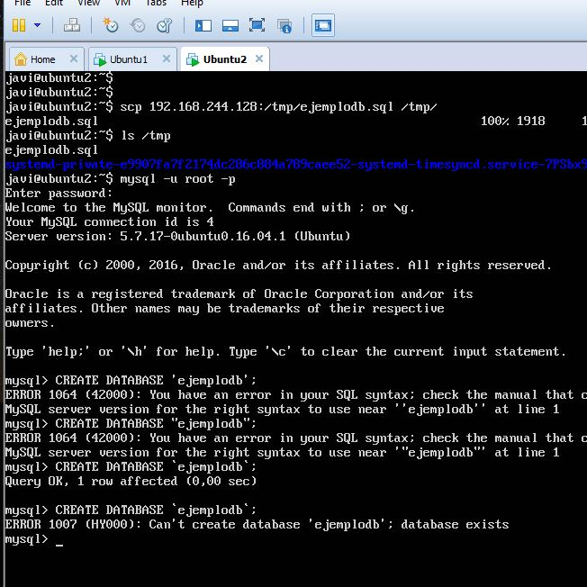

Lo añadimos a nuestra BDD y vemos que se copian los datos:

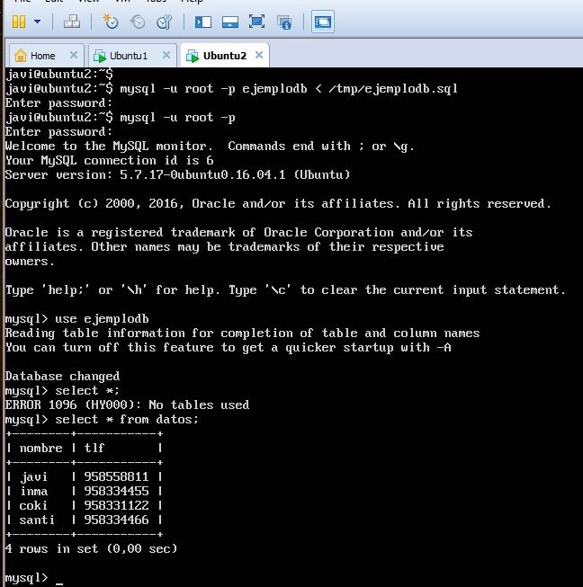

### 4. Realizar la configuración maestro-esclavo de los servidores MySQL para que la replicación de datos se realice automáticamente.

Conectando mysql en la máquina 1

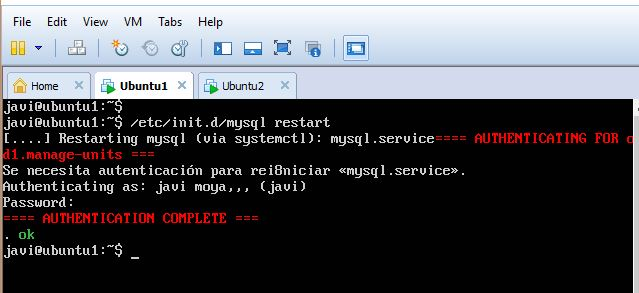

Conectando mysql en la máquina 2

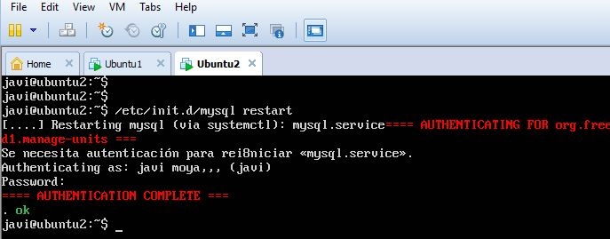

Creando configuración MASTER 

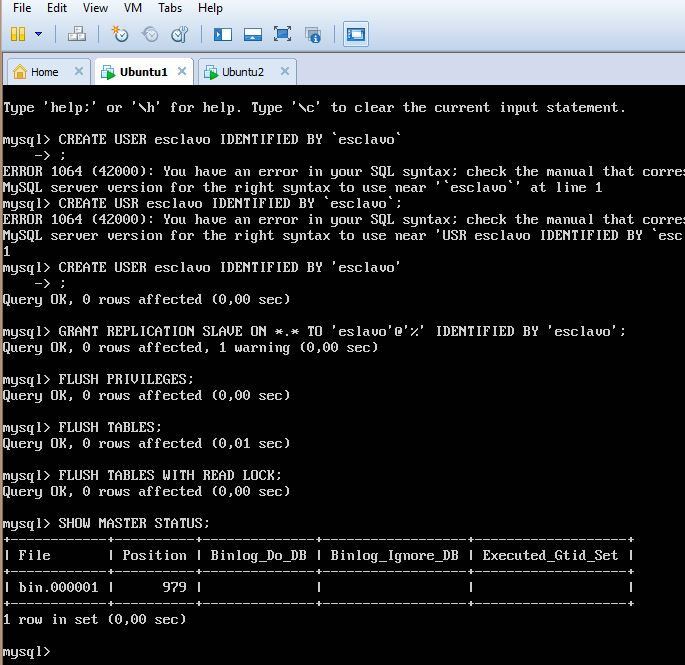

Creando configuración SLAVE

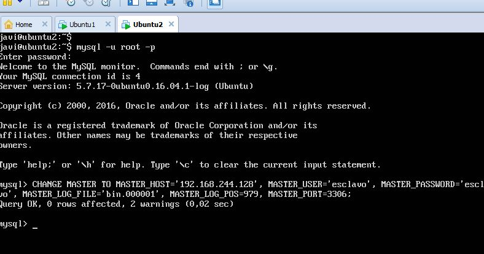

Vemos que no sale null y no ha habido fallos

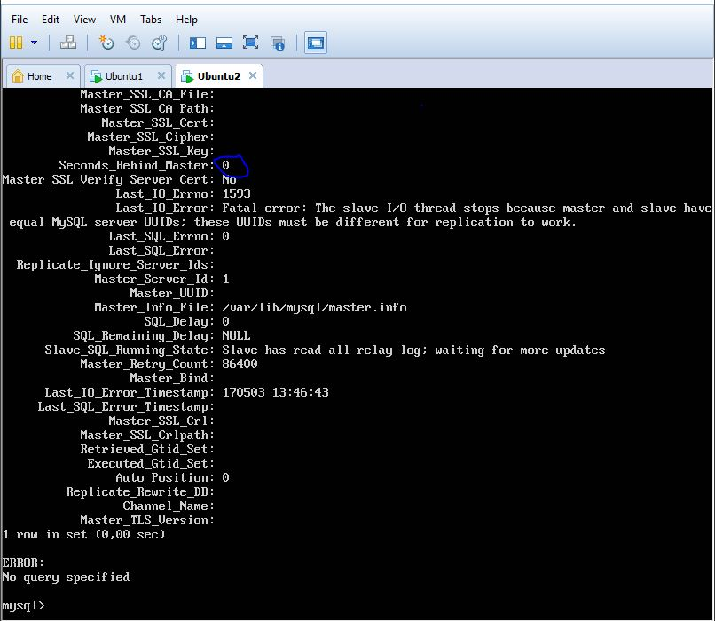

Pero a la hora de la inserción he tenido problemas, he buscado soluciones por internet al problema de tener el mismo UUID en las máquinas pero no he podido solucionarlo.

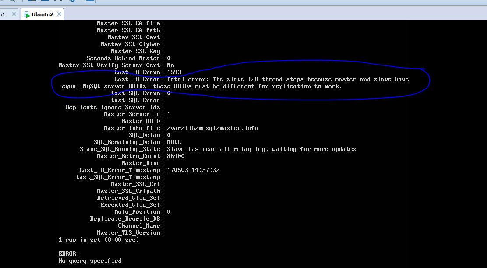

