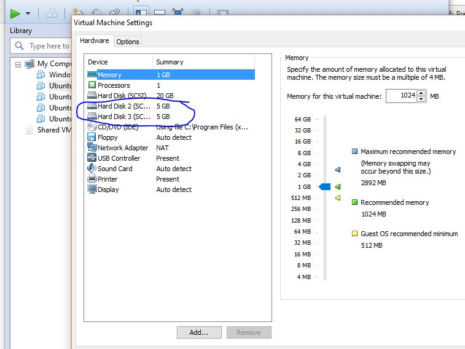
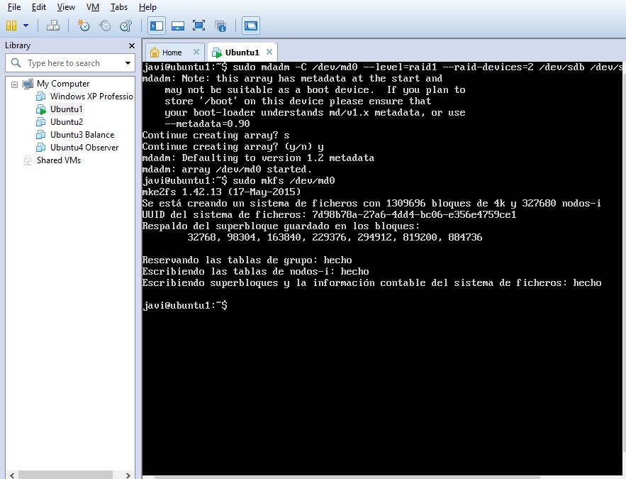

# Práctica 6

### 1. realizar la configuración de dos discos en RAID 1 bajo Ubuntu, automatizando el montaje del dispositivo creado al inicio del sistema.

Creo los dos disco que vamos a utilizar junto con RAID 1

Realizamos la configuración para los dos discos

Modificamos el archivo /etc/fstab para añadir el UUID por el que reconocerá el RAID

### 2. Simular un fallo en uno de los discos del RAID (mediante comandos con el mdadm), retirarlo “en caliente”, comprobar que se puede acceder a la información que hay almacenada en el RAID, y por último, añadirlo al conjunto y comprobar que se reconstruye correctamente.

Generamos un fallo en el disco sdb y luego lo eliminamos de forma lógica para ver el comportamiento del RAID 1 

Ahora añadimos de nuevo el disco sdb y vemos la diferencia, al estar eliminado no se anida con el disco md0 y no sería un disco útil para nuestro propósito
en la última imagen se añade y vuelve a estar correcto.

